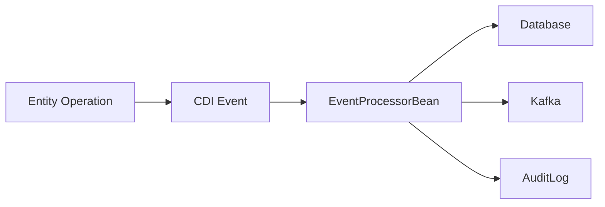

# CDI Event Processing Pipeline ⚡️🔄

## Flow Diagram

1. Entity Setup
```java
@Entity
@HyperResource(events = @Events(onCreate=true))
public class Order extends BaseEntity {
    // fields...
}
```
2. Event Processor Bean
```java
@ApplicationScoped
public class OrderEventProcessor {
    
    @Inject
    OrderAuditLogger auditLogger;
    
    @Inject
    OrderValidationService validator;
    
    @Inject
    @Channel("order-events")
    Emitter<OrderEventMessage> emitter;

    public void processOrderEvent(@Observes EntityEvent<Order> event) {
        // 1. Validate
        validator.validate(event.getEntity());
        
        // 2. Transform
        OrderEventMessage msg = convertToMessage(event);
        
        // 3. Process
        auditLogger.logEvent(event);
        emitter.send(msg);
        
        // 4. Post-process
        handleSideEffects(event);
    }
    
    private OrderEventMessage convertToMessage(EntityEvent<Order> event) {
        return new OrderEventMessage(
            event.getType(),
            event.getEntity().getId(),
            event.getEntity().getStatus()
        );
    }
}

public class OrderEventMessage {
    public enum EventType { CREATED, UPDATED, DELETED }

    public EventType type;
    public UUID orderId;
    public String status;
    public Instant timestamp = Instant.now();

    // constructor...
}
```

## Processing Stage
1. Validation
```java
@ApplicationScoped
public class OrderValidationService {
    public void validate(Order order) {
        // business rules...
    }
} 
```
2. Audit Logging
```java
@ApplicationScoped 
public class OrderAuditLogger {
    public void logEvent(EntityEvent<Order> event) {
        // persist to audit table...
    }
}
```

3. Downstream Forwarding
```java
@Outgoing("order-events")
public CompletionStage<Void> sendToKafka(OrderEventMessage msg) {
    return emitter.send(msg);
}
```

## Error handling
```java
@Retry(maxRetries = 3, delay = 1, delayUnit = ChronoUnit.SECONDS)
@Fallback(fallbackMethod = "fallbackProcessing")
public void processOrderEvent(@Observes EntityEvent<Order> event) {
    // main processing...
}

private void fallbackProcessing(EntityEvent<Order> event) {
    // store for reprocessing...
}
```

> Key Benefits
> - Decoupled processing stages 
> - Atomic retry/failure handling
> - Clear audit trail
> - Easy to add new processors

