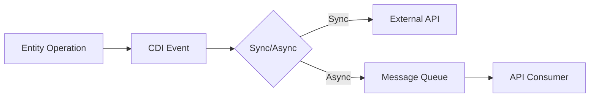

# CDI Event System with External API Integration 🌐⚡

## Architecture

## 1. Core Components
```java
public abstract class BaseEntityService<ENTITY, DTO, MAPPER> {
    @Inject Event<EntityEvent<ENTITY>> eventBus;
    
    protected void fireEvent(EntityEvent.Type type, ENTITY entity) {
        eventBus.fire(new EntityEvent(type, entity));
    }
}
```

## 2. Synchronous API Sender
```java
@ApplicationScoped
public class SyncApiNotifier {
    
    @Inject
    @RestClient
    OrderApiClient apiClient;
    
    @Inject
    ApiResponseLogger logger;

    public void callExternalApi(@Observes EntityEvent<Order> event) {
        ApiRequest request = convertToRequest(event);
        
        // Synchronous call
        try {
            ApiResponse response = apiClient.sendOrderEvent(request);
            logger.logSuccess(event, response);
        } catch (Exception e) {
            logger.logFailure(event, e);
            throw new EventProcessingException("API call failed", e);
        }
    }
}
```

## 3. Asynchronous API Sender
```java
@ApplicationScoped
public class AsyncApiDispatcher {
    
    @Inject
    @Channel("api-requests")
    Emitter<ApiRequest> emitter;
    
    @Incoming("api-responses")
    public void handleResponse(ApiResponse response) {
        // Process async responses
    }

    public void queueApiRequest(@ObservesAsync EntityEvent<Order> event) {
        emitter.send(convertToRequest(event))
            .thenAccept(msgId -> log.debug("Queued: {}", msgId))
            .exceptionally(e -> {
                log.error("Queue failed", e);
                return null;
            });
    }
}
```

## 4. API Client Contracts
### Rest Client Interface
```java
@Path("/v1/events")
@RegisterRestClient
public interface OrderApiClient {
    
    @POST
    @Produces(MediaType.APPLICATION_JSON)
    ApiResponse sendOrderEvent(ApiRequest request);
}
```
### API Request/Response Models
```java
public class ApiRequest {
    public String eventId;
    public String eventType;
    public String entityId;
    public Instant timestamp;
    // Additional fields...
}
```

## Error Handling
### Circuit Breaker
```java
@CircuitBreaker(
    requestVolumeThreshold=4,
    failureRatio=0.5,
    delay=5, 
    delayUnit=ChronoUnit.SECONDS
)
public ApiResponse sendOrderEvent(ApiRequest request) {
    // API call...
}
```
### Retry Policy
```java
@Retry(
    maxRetries = 3,
    delay = 1,
    delayUnit = ChronoUnit.SECONDS
)
public void callExternalApi(@Observes EntityEvent<Order> event) {
    // API call...
}
```

> Best Practices 
> - Use sync for critical operations requiring immediate feedback
> - Use async for high-volume or non-critical events 
> - Always implement circuit breakers and retries 
> - Log all API interactions for audit purposes 
> - Consider idempotency keys for retry scenarios