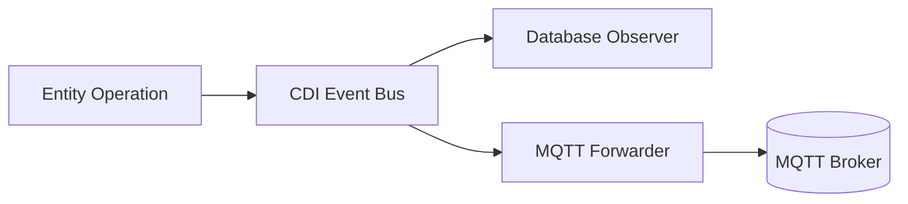

# CDI Event System with MQTT Forwarding 🌐⚡

## System Architecture


1. Base Configuration (Unchanged)
```java
@Entity
@HyperResource(events = @Events(onCreate=true, onUpdate=true, onDelete=true))
public class Order extends BaseEntity {
    // Entity fields...
}
```

2. MQTT Forwarder Implementation
```java
@ApplicationScoped
public class MqttEventForwarder {
    
    @Inject
    @Channel("mqtt-out")
    Emitter<String> mqttEmitter;

    public void forwardOrderEvent(@Observes EntityEvent<Order> event) {
        MqttMessage message = new MqttMessage()
            .setTopic("orders/" + event.getType().name().toLowerCase())
            .setPayload(serializeEvent(event));
        
        mqttEmitter.send(message);
    }

    private String serializeEvent(EntityEvent<Order> event) {
        return JsonbBuilder.create().toJson(new EventDto(
            event.getEntity().getId(),
            event.getType(),
            event.getEntity()
        ));
    }

    private static class EventDto {
        public UUID id;
        public EntityEvent.Type type;
        public Order entity;
        // Constructor...
    }
}
```